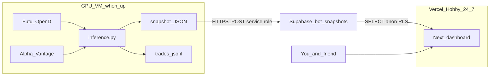

# Phase 5: 24/7 read-only dashboard

Carry forward the leftover [vercel dashboard plan](.cursor/plans/vercel_dashboard_guide_1b431511.plan.md). Phase 4 paper-trading stays locked. This phase adds a friend-facing site that survives VDI auto-shutdown.

After you approve, this chat writes the source-of-truth guide, then implements Python in this repo, then a Next.js app under `dashboard/`. You create the free Vercel + Supabase accounts in parallel (the agent cannot log in as you).

## Frozen conclusions (do not reopen)

- **Trading stays on the GPU VM.** [`run_trader.bat`](predict_now.bat) / [`src/inference.py`](src/inference.py) + Futu OpenD. Vercel never calls Futu, never loads `best_model.zip`, never places orders, never uses `ALPHAVANTAGE_API_KEY`.
- **VM death is accepted.** University VDI ~30 min idle then shutdown. No mouse-jigglers. Catch-up already exists on next login. The site shows **last snapshot time** and a stale banner when the VM is down.
- **One-way data.** VM POSTs snapshots. Vercel only SELECTs. The site must not call Alpha Vantage (keys, 75/min, and scores would disagree with the bot).
- **Humans need headlines; the model needs a number.** [`latest_ticker_score`](src/news_loader.py) already parses `title` / `url` / `source` in `_extract_articles`, then throws them away and returns a float. Telegram only gets fill *reasons*. Phase 5 keeps those titles in the snapshot.
- **Streamlit-on-VM is rejected** (dies with VDI). Streamlit Community Cloud is rejected (secrets + pickle). Original [`guide/PLAN.md`](guide/PLAN.md) Streamlit box is obsolete.
- **Do not** retrain, change Promote, add `--dry-run` to `run_trader.bat`, or touch goldens.

## Architecture

**Lock tools**

- Site: **Vercel** Hobby, Root Directory = `dashboard/` in this same git repo (no second repo unless you insist later).
- Store: **Supabase** free Postgres. One table `bot_snapshots`. Always INSERT (history = equity sparkline). Latest row = current book.
- Auth: Next.js middleware cookie/query `DASHBOARD_GATE` (Hobby-safe). Optional Vercel Deployment Protection on top.
- Local blotter: append-only `data/logs/trades.jsonl` on the VM so a failed push does not lose fills.
- HTTP from Python: existing `requests` (no new heavy client). If push env vars are unset, push is a no-op so the trader still runs.

Do **not** use: Streamlit as the shared UI, git-pushed JSON every minute, Alpha Vantage or Futu credentials on Vercel.

## Snapshot contract

Each POST body is JSON. Stale if `updated_at` is older than **3 minutes**.

- `kind`: `live` (trader loop) only. Skip `predict_now` by default (noise). Never push from `--dry-run` / `test_inference.bat`.
- `updated_at`: HK ISO.
- Book: `cash`, `equity`, `holdings`, `last_action`, `last_reason`, `last_bar_datetime`.
- Model news: `news_scores` per `CORE_TICKERS`.
- Human news: last ~5–10 items per ticker `{title, source, url, time_published, sentiment_score}`.
- Fills: last N from jsonl `{time, ticker, side, qty, price, reason, order_id}`.
- P&L: `pnl = equity - INITIAL_CASH` (default 1_000_000 from [`src/utils.py`](src/utils.py)). Sparkline = last N inserted `equity` values.

Cadence: every live 60s cycle (`--poll-seconds 60`), and immediately after a successful SIMULATE fill.

## Human accounts (you, before or during build)

1. Vercel project on this GitHub repo, Root Directory `dashboard`.
2. Supabase project. SQL sketch lives in the Phase 5 guide. Copy **URL + service role** only onto the **VM** `.env` as `DASHBOARD_PUSH_URL` / `DASHBOARD_PUSH_KEY`. Vercel gets URL + **anon** key. RLS: anon `SELECT` only; no anon `INSERT`.
3. Shared `DASHBOARD_GATE` for the two of you. Do not share OpenD or `.env`.
4. You do **not** need VDI open for the website. You **do** need VDI for new trades and new headlines.

## Code in this repo (Python)

Keep the live loop, catch-up, Promote, and bats unchanged except they pick up new modules automatically.

1. **Headlines without a second AV call.** Add `latest_ticker_news()` next to [`latest_ticker_score`](src/news_loader.py) (same request, return score + article rows). Keep `latest_ticker_score` as a thin wrapper so training / poller callers stay valid.
2. **[`NewsPoller`](src/inference.py)** caches headlines in memory (not in `state.pkl`). Closed-market fetch skip still returns last cached headlines + score.
3. **Local blotter.** After `place_order` succeeds (not dry-run, not predict-now), append one jsonl line. Change `place_order` to surface `order_id` when Futu returns it (today it logs the id then returns only `bool`).
4. **[`src/dashboard_push.py`](src/dashboard_push.py)** (new): build payload, POST to Supabase. **Never raise into the trade path** — log and continue if the DB is down.
5. Call push from the live loop only (including `--once` if not dry-run). Skip `--predict-now` and `--dry-run`.
6. **[`.env.example`](.env.example)** (new): `DASHBOARD_PUSH_URL`, `DASHBOARD_PUSH_KEY`, `DASHBOARD_GATE` documented for the site. No secrets in git.

## Code in `dashboard/` (Next.js on Vercel)

New App Router app. Server-side SELECT of the latest snapshot plus last N rows for the sparkline.

v1 UI:

- Stale banner + last snapshot time (HK).
- Book table (cash, equity, holdings, last action/reason, last bar).
- Headline list per ticker (title links out).
- Fill blotter.
- P&L vs `INITIAL_CASH` + small equity sparkline.
- Client poll every 15–30s (Supabase realtime is nice-to-have, not v1).

Out of scope for v1: live ticks, friend placing orders, Streamlit, VM keep-alive, tax lots, `kind: preview` from `predict_now`.

## Docs (source of truth, same pattern as Phase 4)

- Create [`guide/PHRASE-5.md`](guide/PHRASE-5.md): copy-pasteable env names, table SQL, snapshot JSON example, new-agent prompt at the top, operator checklist. If this file disagrees with older markdown, **this file wins for the dashboard**.
- Rewrite [`guide/PHRASE-4-EXECUTION-&-DAILY-WORK.md`](guide/PHRASE-4-EXECUTION-&-DAILY-WORK.md) §6b from “there is no live dashboard” to a pointer at Phase 5. Phase 4 still wins for trading.

New-agent prompt (also at the top of PHRASE-5): *Read `guide/PHRASE-5.md` and `guide/PHRASE-4-EXECUTION-&-DAILY-WORK.md`. Do not retrain, do not change Promote, do not add `--dry-run` to `run_trader.bat`.*
