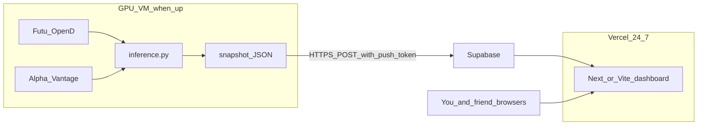

# Phase 5 Vercel dashboard (guide first)

This work is **documentation + a later build recipe**, not a live site in this chat. After you approve, the agent writes `[guide/DASHBOARD-VERCEL.md](guide/DASHBOARD-VERCEL.md)` so a **brand-new Cursor window** can implement without this conversation.

## Conclusions to freeze in the markdown (do not reopen)

- **Trading stays on the university GPU VM** (`run_trader.bat` + Futu OpenD + `[src/inference.py](src/inference.py)`). Vercel never calls Futu, never loads `best_model.zip`, never places orders.
- **VM idle/shutdown is accepted.** University VDI ~30 min idle then auto-shutdown. Do not build mouse-jigglers. Catch-up already exists for the next login. The site shows **last snapshot time** when the VM is dead.
- **One-way data:** VM (when up) pushes snapshots; Vercel only reads. Vercel must **not** call Alpha Vantage (keys, 75/min, and scores would disagree with the bot), at the moment decision only.
- **Humans need headlines, the model needs a number.** Today `[latest_ticker_score](src/news_loader.py)` already parses `title` / `url` / `source` then **throws them away** and returns a float. The dashboard needs those titles in the payload. Telegram today only gets fill *reasons*, not a headline list.
- **Streamlit-on-VM is rejected** for the friend (dies with VDI). Streamlit Community Cloud is rejected (secrets + pickle). **Vercel = 24/7 read-only UI.**

## Suggested student-free tools (lock these in the guide)

| Role                                                       | Tool                                                                              | Why                                                                 |
| ---------------------------------------------------------- | --------------------------------------------------------------------------------- | ------------------------------------------------------------------- |
| Website                                                    | **Vercel** (you already deploy here)                                              | Free HTTPS, friend opens on phone                                   |
| Snapshot store                                             | **Supabase** free (Postgres + REST)                                               | VM `POST`s JSON; Vercel server components / route handlers `SELECT` |
| Auth (enough)                                              | Vercel Deployment Protection **or** a shared `DASHBOARD_GATE` query/cookie secret | Two uni students, not a public product                              |
| Local blotter (optional but recommended before first push) | Append-only `data/logs/trades.jsonl` on the VM                                    | Survives a failed push; source of fill history                      |

Fallback if you refuse another account: a **private GitHub repo JSON** + Vercel fetch is uglier (git every minute). Prefer Supabase.

Do **not** use: Streamlit on the VM as the shared UI; hosting the site on the VDI; putting `ALPHAVANTAGE_API_KEY` or Futu credentials on Vercel.

## Target data flow (implement later)

**Snapshot shape (write this in the guide as the contract):**

- `updated_at` (HK ISO), `vm_alive` implied by freshness (e.g. stale if older than 3 minutes)
- Book: `cash`, `equity`, `holdings`, `last_action`, `last_reason`, `last_bar_datetime`
- Model news: `news_scores` per `CORE_TICKERS`
- Human news: last ~5–10 items per ticker `{title, source, url, time_published, sentiment_score}`
- Fills: last N `{time, ticker, side, qty, price, reason, order_id}`
- P&L: `equity - INITIAL_CASH` (and later a small equity sparkline from appended snapshots)

Push cadence: on each **SIMULATE fill**, and otherwise every **60s** while the trader loop runs (same as `--poll-seconds 60`). `predict_now` may push a preview snapshot tagged `kind: preview` with **no** fill (optional; default skip to avoid noise).

## What the human (you) must do before a new chat can ship the site

Accounts (free):

1. Vercel account; create an empty project (or a second GitHub repo `airaire-dashboard` so the Python trader repo stays clean).
2. Supabase project: one table e.g. `bot_snapshots` (jsonb payload + `created_at`) and optionally `bot_fills`; copy **URL + service role key** only into the **VM** `.env` as `DASHBOARD_PUSH_URL` / `DASHBOARD_PUSH_KEY`. Vercel gets the **anon** key + RLS that allows `SELECT` only, or a server-only secret.
3. A **push token** the VM sends (`DASHBOARD_PUSH_TOKEN`); Vercel never trusts anonymous writes from the internet without it.
4. Share the Vercel URL with your friend; do not share OpenD or `.env`.

You do **not** need to keep VDI open for the **website**. You **do** need VDI for **new** trades and **new** headlines.

## What a new Cursor chat should implement (ordered)

Tell the new window: *Read `[guide/DASHBOARD-VERCEL.md](guide/DASHBOARD-VERCEL.md)` and `[guide/PHRASE-4-EXECUTION-&-DAILY-WORK.md](guide/PHRASE-4-EXECUTION-&-DAILY-WORK.md)`. Do not retrain, do not change Promote, do not add `--dry-run` to `run_trader.bat`.*

Code in **this** repo (Python):

1. Keep headlines in `[src/news_loader.py](src/news_loader.py)` (`latest_ticker_score` or a sibling that returns score + article rows).
2. Append fills to a local jsonl from `[src/inference.py](src/inference.py)` after successful `place_order` (not on `--predict-now`).
3. Small `src/dashboard_push.py`: POST snapshot; **never raise into the trade path** (log and continue if Supabase is down).
4. Call push from the live loop only (not `test_inference.bat` / `--dry-run`).
5. `.env.example` keys only; no secrets in git.

Code in **dashboard repo** (or `dashboard/` if you prefer one repo):

1. Next.js on Vercel: stale banner, book table, headline list, fill blotter, equity vs `INITIAL_CASH`.
2. Poll every 15–30s or use Supabase realtime (nice-to-have).

Out of scope for v1: live streaming ticks, friend placing orders, Streamlit, VM keep-alive, full accounting tax lots.

## This chat’s only file work (after you approve)

- Create `[guide/DASHBOARD-VERCEL.md](guide/DASHBOARD-VERCEL.md)` with the above, copy-pasteable env names, table SQL sketch, and a “new agent prompt” block at the top.
- Link it from Phase 4 runbook §6b.

